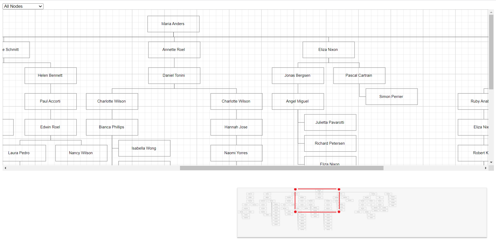

# Create a Layout where we can filter nodes based on annotation

This sample demonstrates how to create a layout sample with annotation filtering implementation

In this sample, We have created a layout sample with overview control and node filtering based on the annotation node and focus them to fit in the view port.

FloorPlans Sample:

## Prerequisites

* Visual Studio 2022

## How to run the project

* Checkout this project to a location in your disk.
* Open the solution file using the Visual Studio 2022.
* Restore the NuGet packages by rebuilding the solution.
* Run the project.