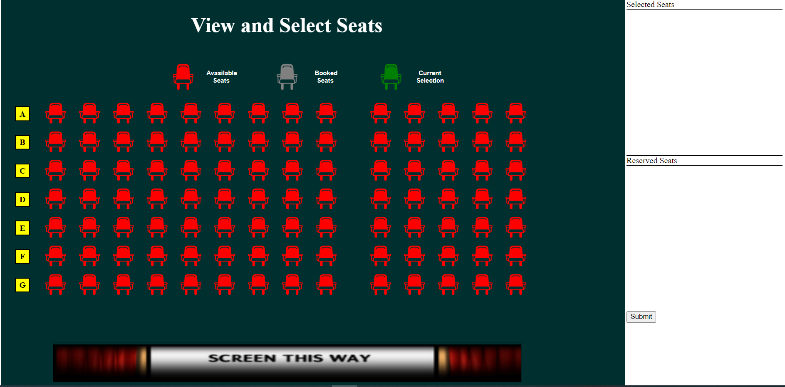

# Create a use case sample for Seat Reservation

This sample demonstrates how to make Seat Reservation model.

In this sample, We have created Portal for the seat reservation with seat positions and updates seats availability while interactions and also shows booking status.

Seat Reservation Sample:

## Prerequisites

* Visual Studio 2022

## How to run the project

* Checkout this project to a location in your disk.
* Open the solution file using the Visual Studio 2022.
* Restore the NuGet packages by rebuilding the solution.
* Run the project.